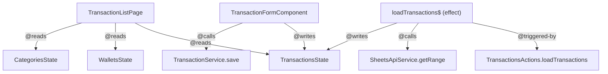

# Dependency Tags — Esquema, Reglas y Prompt Enricher

Sistema de trazabilidad basado en tags JSDoc estructurados. Permite al `prompt-enricher`
construir grafos de dependencia sin explorar el proyecto archivo por archivo.

---

## 1. Esquema de Tags

### Tags disponibles

| Tag | Dónde va | Qué declara |
|-----|----------|-------------|
| `@reads {State}.{selector}` | `toSignal()`, `computed()`, método | Lee un selector NgRx o signal de otro servicio |
| `@writes {State}` | método, effect | Hace dispatch de una acción que muta el state |
| `@calls {Service}.{method}` | método, effect | Invoca un método de servicio (SheetsApi, etc.) |
| `@emits {outputName}` | método | Dispara un `output()` signal hacia el componente padre |
| `@triggered-by {acción\|evento}` | effect, método lifecycle | Qué acción NgRx o evento del usuario lo activa |

### Sintaxis estricta

```
@reads   {NombreState}.{nombreSelector}
@writes  {NombreState}
@calls   {NombreService}.{nombreMetodo}
@emits   {nombreOutput}
@triggered-by {NombreActions}.{nombreAction} | ngOnInit | click | ionRefresh
```

Siempre **PascalCase** para State y Service. **camelCase** para selector, método y output.
Un tag por línea cuando hay más de uno.

---

## 2. Ejemplos por tipo de artefacto

### `toSignal()` — un tag @reads obligatorio

```typescript
/** @reads TransactionsState.selectAll — lista completa para filtrado local */
readonly allTransactions = toSignal(
  this.store.select(selectAllTransactions),
  { initialValue: [] }
);

/** @reads WalletsState.selectAllWallets — pobla el selector de filtro */
readonly wallets = toSignal(
  this.store.select(selectAllWallets),
  { initialValue: [] }
);
```

### `computed()` — @reads de cada signal que consume

```typescript
/**
 * @reads TransactionsState.selectAll
 * @reads WalletsState.selectAllWallets
 * Filtra transacciones por cartera y período activos.
 */
readonly visible = computed(() =>
  this.allTransactions().filter(t =>
    t.walletId === this.filterWallet() &&
    t.date >= this.periodStart()
  )
);
```

### Método público — @reads, @writes, @calls, @emits según corresponda

```typescript
/**
 * @writes TransactionsState
 * @calls TransactionService.save
 * Valida el form, persiste en Sheets y cierra el modal.
 */
async onSave(): Promise<void> {
  if (!this.form.valid) return;
  this.store.dispatch(TransactionsActions.saveTransaction({ transaction: this.form.value }));
}

/**
 * @emits transactionSelected
 * @reads TransactionsState.selectAll
 * Emite la transacción elegida al componente padre.
 */
onSelect(id: string): void {
  const tx = this.allTransactions().find(t => t.id === id);
  if (tx) this.transactionSelected.emit(tx);
}
```

### NgRx Effect — @triggered-by y @calls obligatorios

```typescript
/**
 * @triggered-by TransactionsActions.loadTransactions
 * @calls SheetsApiService.getRange
 * @writes TransactionsState
 */
export const loadTransactions$ = createEffect(
  (actions$ = inject(Actions), sheetsApi = inject(SheetsApiService)) =>
    actions$.pipe(
      ofType(TransactionsActions.loadTransactions),
      switchMap(() =>
        sheetsApi.getRange(...).pipe(
          map(data => TransactionsActions.loadTransactionsSuccess({ transactions: data })),
          catchError(err => of(TransactionsActions.loadTransactionsFailure({ error: err.message })))
        )
      )
    ),
  { functional: true }
);
```

---

## 3. Actualización — `.claude/rules/angular.md`

Agregar la siguiente sección inmediatamente después del bloque
**"Reglas de comentarios — toSignal() y computed()"** existente:

---

### Tags de trazabilidad — obligatorios en toda función pública y signal

Toda función pública, `toSignal()` y `computed()` debe declarar sus dependencias
con los tags estructurados definidos en `.claude/dependency-tags.md`.

**Estos tags reemplazan y extienden la regla de JSDoc libre anterior.**
El formato libre ("Carteras activas del usuario…") se mantiene como descripción,
pero ahora los tags van primero en líneas separadas.

```typescript
// ✅ formato correcto
/**
 * @reads WalletsState.selectAllWallets
 * @reads CategoriesState.selectActiveCategories
 * Datos necesarios para el formulario de nueva transacción.
 */
readonly formDeps = computed(() => ({
  wallets: this.wallets(),
  categories: this.categories(),
}));

// ❌ solo descripción libre — ya no alcanza
/** Datos necesarios para el formulario de nueva transacción. */
readonly formDeps = computed(() => ({ ... }));

// ❌ tag con formato libre — no grepable
/** @reads wallets del store — carteras activas */
```

**Regla de cobertura:**

| Artefacto | Tags obligatorios |
|-----------|------------------|
| `toSignal()` | `@reads` |
| `computed()` | `@reads` de cada signal que consume |
| Método público | Todos los que apliquen: `@reads`, `@writes`, `@calls`, `@emits` |
| Effect funcional | `@triggered-by`, `@calls`, `@writes` |
| Método privado con efecto secundario | `@calls` o `@writes` |

Los métodos privados sin efectos secundarios (helpers de transformación pura) no necesitan tags.

---

## 4. Actualización — `.claude/commands/prompt-enricher.md`

Reemplazar el **paso 3** actual por esta versión expandida:

---

### Paso 3 — Grep de dependencias y grafo Mermaid

Para cada feature identificada, ejecutar los siguientes greps antes de responder:

```bash
# 1. Qué archivos leen de cada state afectado
grep -rn "@reads {FeatureState}" src/

# 2. Qué archivos escriben en cada state afectado
grep -rn "@writes {FeatureState}" src/

# 3. Qué effects o métodos llaman a los servicios relacionados
grep -rn "@calls {ServiceName}" src/

# 4. Qué dispara los effects del feature
grep -rn "@triggered-by {FeatureActions}" src/
```

Con los resultados, construir un grafo Mermaid de dependencias:



### Formato de respuesta enriquecida (nuevo)

```
{prompt original del usuario}

## Contexto automático
**Features detectados:** {lista}

**Grafo de dependencias:**
{bloque mermaid generado desde greps}

**Archivos directamente afectados:**
- `{ruta/archivo.ts}:{línea}` — {qué tag lo relaciona}

**Flujos cross-feature:**
- {descripción del flujo entre features}

**Reglas de capa a consultar:** {lista de archivos en .claude/rules/}
```

### Notas de implementación

- Si un archivo no tiene tags, indicarlo explícitamente: "⚠️ `{archivo}` no tiene tags de trazabilidad — exploración manual requerida."
- El grafo prioriza los nodos del feature pedido; los nodos externos (SheetsApiService, AuthService) van al borde del grafo sin expandir sus propias dependencias.
- No inventar relaciones que no estén en los tags — solo lo que grep devuelve.
